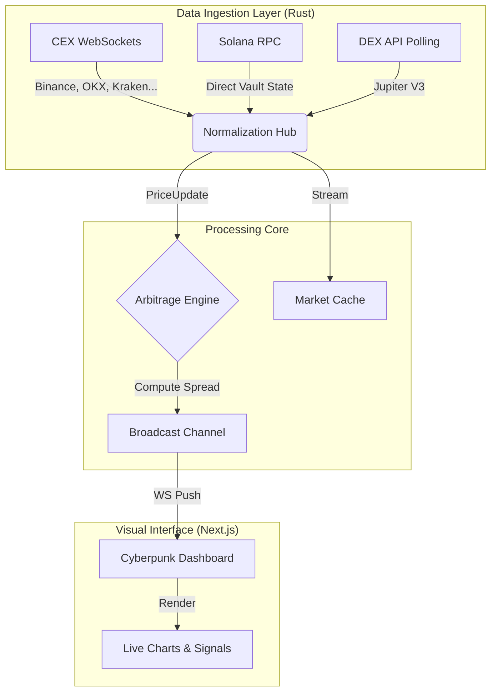

# ⚡ W3:Terminal ENGINE


**W3:Terminal Engine** is a high-frequency, quantum-styled cryptocurrency
arbitrage terminal. It fuses a multi-threaded **Rust** backend with a
holographic **Next.js** frontend to visualize and capture liquidity
fractures across Centralized (CEX) and Decentralized (DEX) exchanges in
real-time.

🔗 Live link : [**W3:Terminal**](https://w3terminal.vercel.app/)

> *"The gap between price and value is where the profit lies."*

------------------------------------------------------------------------

## 🎥 Demo Video

A full walkthrough demo of the **W3:Terminal Engine** is  available
here:

https://github.com/user-attachments/assets/6e05493e-5bb5-44d9-bfa3-85823d89d415


------------------------------------------------------------------------

## 🧠 System Architecture

The engine operates on a **Hybrid Connectivity Model**, bridging three
distinct data protocols into a unified, zero-latency event stream.



------------------------------------------------------------------------

## ✨ Key Features

### 🦀 Rust Backend (/server)

-   **Hybrid Connector System:**
    -   **WebSockets:** Persistent, reconnecting streams for CEXs
        (Binance, Coinbase, Kraken, OKX, Bybit, KuCoin, Bitget, HTX,
        Bitfinex, Backpack).
    -   **Direct RPC State Reading:** Reads raw `sqrt_price` from Orca
        Whirlpools and token vault balances from Raydium for maximum
        speed.
-   **In-Memory Arbitrage:** Microsecond-level best-bid/best-ask
    computation.
-   **Tokio Runtime:** Fully asynchronous, handling thousands of
    concurrent tick updates.

### 🖥️ Cyberpunk Frontend (/client)

-   Custom neon-reactive cyberpunk UI.
-   Real-time charts, opportunity radar, and reconnecting WebSocket
    hooks.
-   Market surveillance over 13+ liquidity sources.

------------------------------------------------------------------------

## 🔌 Supported Exchanges

### Centralized (CEX)

Binance, OKX, Bybit, HTX, KuCoin, Bitget, Bitfinex, Backpack.

### Decentralized (Solana DEX)

Orca (Whirlpools --- Direct RPC), Raydium, Jupiter V3 API.

------------------------------------------------------------------------

## 🛠️ Installation & Setup

### **Prerequisites**

-   Rust (Stable)
-   Node.js (18+)
-   Solana RPC URL

------------------------------------------------------------------------

### **1. Run the Engine**

github link : [**Server Repo**](https://github.com/ktan-wolf/W3Terminal_server)

backend engine url : [**https://w3terminal-server.onrender.com/**](https://w3terminal-server.onrender.com/)

``` bash
cd W3:Terminal_server
cargo run --release
```
📌 NOTE : Change the address to localhost

Access endpoint:

    ws://127.0.0.1:8081/ws/subscribe

------------------------------------------------------------------------

### **2. Launch Next.js Dashboard**

github link : [**Client Repo**](https://github.com/ktan-wolf/W3Terminal_client)

📌 NOTE : Change the url to Access endpoint => (ws://127.0.0.1:8081/ws/subscribe)

``` bash
cd W3:Terminal_client
npm install
npm run dev
```

Visit → http://localhost:3000

------------------------------------------------------------------------

## 🎮 Usage

1.  Open dashboard (auto-connects to WebSocket)
2.  Enter pair (SOL/USDC, BTC/USDC)
3.  Click **SYNC**
4.  Watch live market grid & arbitrage signals

------------------------------------------------------------------------

## 📂 Project Structure

    ├── W3:Terminal_server/
    │   ├── src/
    │   │   ├── connectors/
    │   │   │   ├── binance.rs
    │   │   │   ├── orca.rs
    │   │   │   ├── raydium.rs
    │   │   │   └── ...
    │   │   ├── arbitrage_engine.rs
    │   │   └── main.rs
    │   └── Cargo.toml
    │
    └── W3:Terminal_client/
        ├── app/
        │   ├── components/
        │   └── page.tsx
        ├── lib/utils.ts
        └── tailwind.config.ts

------------------------------------------------------------------------

## 🤝 Contributing

PRs welcome --- open an issue first for major proposals.

------------------------------------------------------------------------

## 📄 License

MIT License --- Developed by the **W3:Terminal Team**.
